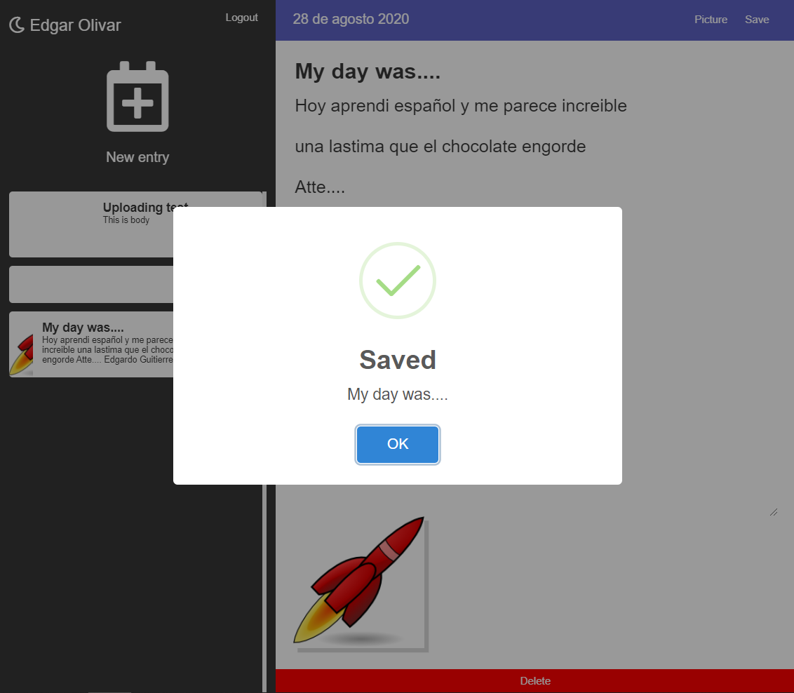
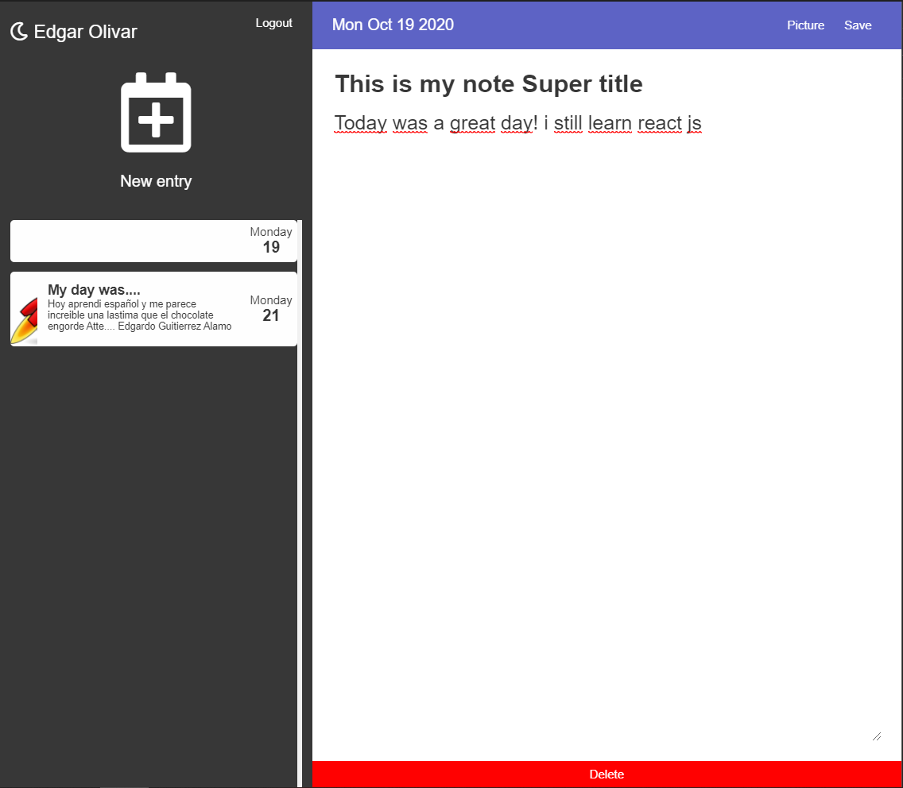

This project was bootstrapped with [Create React App](https://github.com/facebook/create-react-app).

# Notes App (Journal)

This a Journal project, you can create a account, login with social newtworks (google account)
create/update/delete notes, write about your day, upload pictore (using cloudinary), customs alerts
and more!!! 

Snaps:
1. LoginScreen:

  

2. New notes:

  

3. Draw note:

  

run ``` npm install ```

This examples are part from the [react: De cero a Experto (Hooks y MERN) course](https://www.udemy.com/course/react-cero-experto)


